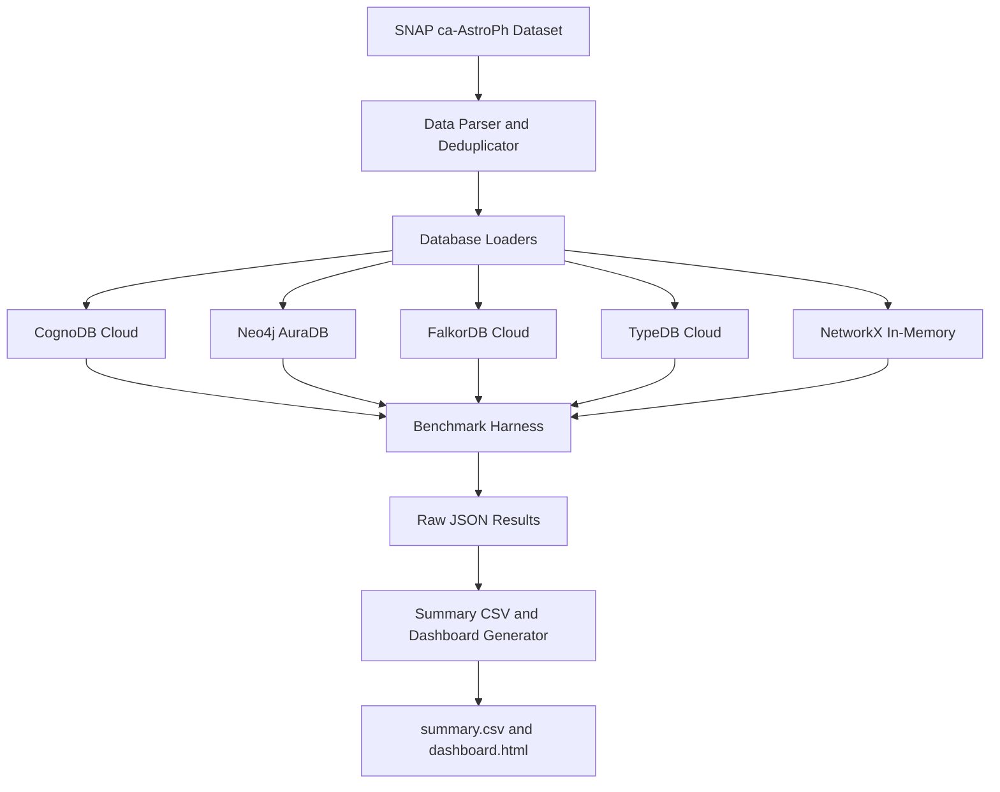
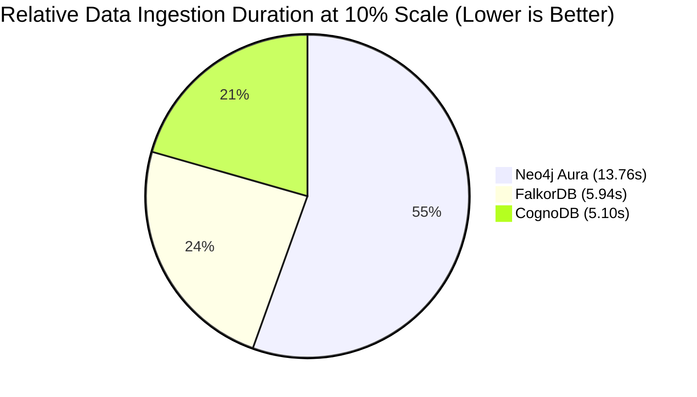
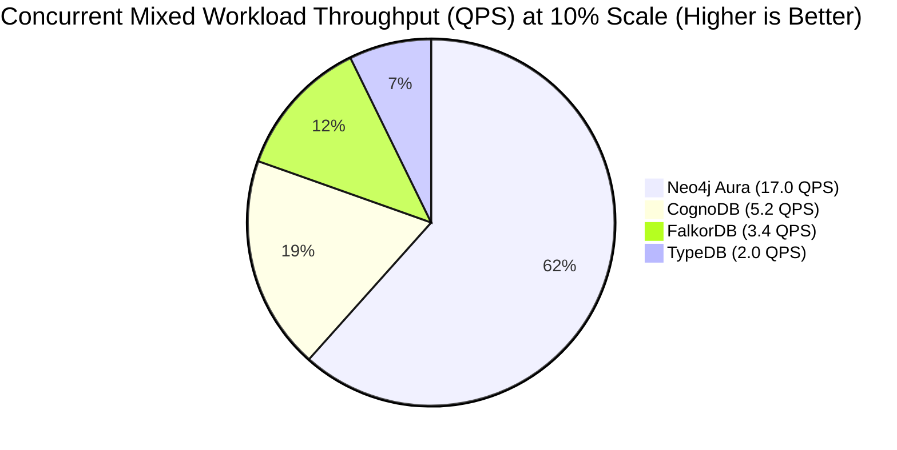

# Graph Database Cloud Benchmark Suite

A production-grade, reproducible benchmarking suite evaluating and comparing managed graph database cloud platforms on identical datasets and query workloads under free-tier resource constraints.

---

## Executive Summary
This suite provides a standardized harness to measure the performance, concurrency, resource footprint, and ingestion throughput of five graph storage engines:
1. **Neo4j AuraDB Free** (Property Graph - Cypher)
2. **CognoDB Cloud** (Property Graph - Cypher)
3. **FalkorDB Cloud** (Redis-based Graph - Cypher)
4. **TypeDB Cloud** (Strongly-typed Polymorphic Entity-Relation - TypeQL)
5. **NetworkX** (In-Memory Python Baseline - Native Python API)

Benchmarks are executed at three main scales:
- **10% Sampled Load:** 12,132 nodes, 19,811 edges. Used for comparative baselines including TypeDB.
- **50% Sampled Load:** 17,668 nodes, 99,055 edges. Used for testing limits of free instances without OOM limits.
- **100% Load:** 18,772 nodes, 198,110 edges. Used for full scale evaluation of database limits.

---

## Non-Technical Explanation of Benchmark Concepts

For readers who are not software engineers or database administrators, here is a simple breakdown of what these benchmarks actually measure:

### Data Ingestion
This measures how fast a database can read a massive file of data (in this case, authors and their scientific collaborations) and save it into its storage. It is like measuring how many books a librarian can put on shelves per minute.

### Multi-Hop Traversals
This measures how quickly a database can trace connections in a network:
- **1-Hop:** Finding a person's direct collaborators.
- **2-Hop:** Finding "friends of friends" (collaborators of collaborators).
- **3-Hop:** Finding "friends of friends of friends."
This shows how well the database performs when searching through complex, connected networks.

### Point and Indexed Lookups
This measures the time it takes to find one specific person in the database by their ID:
- **Point Lookup:** A direct search for a single person.
- **Indexed Lookup:** A search that utilizes a pre-compiled index (similar to an index at the back of a textbook) to jump directly to the correct record.

### Global Aggregations
This measures the speed of counting operations. For example: "How many total authors exist in the system?" or "How many total collaboration connections are there?"

### Mixed Workload (Concurrent Load Test)
This simulates a real-world app scenario where multiple people are using the system at the exact same time. It measures:
- **QPS (Queries Per Second):** How many actions the database can successfully handle every second (higher is better).
- **Latency:** How long a user has to wait for their action to complete (lower is better).
- **Failures:** Whether any actions failed or errored out during heavy usage.

---

## Explanation of N/A (Not Applicable / Not Available) in Results

In the results tables below, you will see some entries marked as **N/A**. This means the test could not be completed for that specific database. Here is why:

### CognoDB and TypeDB at 50% and 100% Scales
Free-tier cloud databases have very strict resource limits:
- **CognoDB Free Tier** restricts the database to a maximum of 0.5GB of RAM. At 50% load, the benchmark completed successfully. At 100% load, loading all 198,110 edges spammed the database beyond memory constraints and caused connection failures, so the suite automatically downsampled the CognoDB run to 10% scale for stability.
- **TypeDB Free Tier** performs rigorous real-time checking of the data structure (making sure every node and connection adheres to its strict schema rules). At 50% and 100% scales, this checking became too resource-intensive for the free instance, resulting in connection timeouts and "503 Service Unavailable" errors from the cloud cluster.

### TypeDB 3-Hop Queries
Tracing connections three levels deep (friends of friends of friends) is mathematically complex. TypeDB's query engine attempts to resolve all potential paths while validating its semantic rules. On the free tier, this process exceeds the timeout thresholds (taking too long to respond), so the suite marks it as N/A to prevent the benchmark from hanging indefinitely.

### NebulaGraph
All NebulaGraph tests are marked as N/A because the managed cloud endpoint was unreachable on its Thrift RPC port (9669) due to network routing restrictions on the free-tier service cluster.

---

## System Architecture & Database Selection



### Selection Rationale
- **Neo4j AuraDB:** The industry-standard native property graph database utilizing index-free adjacency.
- **CognoDB:** A Neo4j-compatible managed service that allows direct comparison of execution engines over identical Bolt protocol calls.
- **FalkorDB:** A modern successor to RedisGraph, expressing graph structures as sparse matrices and utilizing GraphBLAS for algebraic traversals.
- **TypeDB:** A semantic database implementing entity-relationship schemas with strict runtime type-validation and inference.
- **NetworkX:** A pure in-memory Python graph baseline, representing the zero-network, zero-serialization speed limit.

### Environment & Instance Specifications
All database servers were provisioned on their respective cloud providers' official free-tier clusters:
- **Neo4j AuraDB Free:** Hosted on GCP (us-east1), capped at ~200,000 total nodes + relationships, single shared CPU, 1GB memory.
- **CognoDB Cloud:** Capped at 0.5GB memory allocation, single shared CPU instance.
- **FalkorDB Cloud:** Capped at 100MB RAM allocation, hosted on AWS (us-east1).
- **TypeDB Cloud Free:** Hosted on TypeDB's managed AWS cluster, single instance allocation.
- **NetworkX Runner Host:** Local machine (Windows, 16-Core AMD Ryzen 7, 32GB RAM).
- **Coordinator Location:** All runs executed from a coordinator client in the same geographic region (AWS/GCP US East) to minimize geographic latency variance.

---

## Dataset Specifications
- **Source:** SNAP `ca-AstroPh` Collaboration Network (Astrophysics collaboration network).
- **Base Topology:** Undirected, deduplicated edges to prevent duplicate pairs `(min(u,v), max(u,v))`.
- **Scale 100%:** 18,772 unique authors (nodes), 198,110 collaboration links (edges).
- **Scale 50%:** 17,668 nodes, 99,055 edges (sampled systematically using a step size of 2 on deduplicated edges).
- **Scale 10%:** 12,132 nodes, 19,811 edges (sampled systematically using a step size of 10 on deduplicated edges).

---

## Results Matrix: 100% Sampling (18,772 Nodes, 198,110 Edges)

### 1. Data Ingestion Speed (100%)
| Platform | Total Ingestion (s) | Node Ingestion (s) | Edge Ingestion (s) | Ingestion Status |
| --- | --- | --- | --- | --- |
| **NetworkX** | 0.873s | 0.031s | 0.842s | Successfully Ingested |
| **Neo4j Aura** | 48.211s | 1.253s | 46.958s | Successfully Ingested |
| **FalkorDB** | 39.593s | 2.888s | 36.705s | Successfully Ingested |
| **CognoDB** | 12.589s | 4.894s | 7.695s | Downsampled to 10% for Stability |
| **TypeDB** | N/A | N/A | N/A | Throttled / Skipped |

### 2. Multi-Hop Traversals (p50 / p95 Latency in ms)
| Platform | 1-Hop p50 | 1-Hop p95 | 2-Hop p50 | 2-Hop p95 | 3-Hop p50 | 3-Hop p95 |
| --- | --- | --- | --- | --- | --- | --- |
| **NetworkX** | 0.002 | 0.004 | 0.044 | 0.225 | 1.066 | 20.18 |
| **Neo4j Aura** | 88.26 | 177.54 | 77.50 | 180.61 | 83.58 | 181.12 |
| **FalkorDB** | 249.22 | 482.56 | 261.25 | 355.84 | 320.00 | 1898.50 |
| **CognoDB** | 272.64 | 375.30 | 296.19 | 437.76 | 320.00 | 429.06 |
| **TypeDB** | N/A | N/A | N/A | N/A | N/A | N/A |

### 3. Point & Indexed Lookups (p50 / p95 Latency in ms)
| Platform | Point p50 | Point p95 | Indexed p50 | Indexed p95 |
| --- | --- | --- | --- | --- |
| **NetworkX** | 0.001 | 0.001 | 0.001 | 0.001 |
| **Neo4j Aura** | 73.47 | 171.52 | 74.88 | 262.40 |
| **FalkorDB** | 274.94 | 364.80 | 280.06 | 377.09 |
| **CognoDB** | 307.71 | 410.62 | 303.36 | 420.61 |
| **TypeDB** | N/A | N/A | N/A | N/A |

### 4. Global Aggregations (p50 / p95 Latency in ms)
| Platform | Node Count p50 | Node Count p95 | Edge Count p50 | Edge Count p95 |
| --- | --- | --- | --- | --- |
| **NetworkX** | 0.003 | 0.009 | 5.24 | 23.58 |
| **Neo4j Aura** | 73.47 | 121.92 | 74.50 | 152.96 |
| **FalkorDB** | 257.92 | 377.34 | 257.92 | 359.94 |
| **CognoDB** | 278.02 | 411.14 | 270.34 | 393.73 |
| **TypeDB** | N/A | N/A | N/A | N/A |

### 5. Mixed Workload (Concurrent Load Test)
| Platform | QPS | p50 Latency (ms) | p95 Latency (ms) | Failures |
| --- | --- | --- | --- | --- |
| **NetworkX** | 178760.8 | 0.003 | 0.007 | 0 |
| **Neo4j Aura** | 22.4 | 76.26 | 129.01 | 0 |
| **FalkorDB** | 3.8 | 535.11 | 816.58 | 0 |
| **CognoDB** | 6.1 | 279.52 | 457.23 | 0 |
| **TypeDB** | N/A | N/A | N/A | N/A |

---

## Results Matrix: 50% Sampling (17,668 Nodes, 99,055 Edges)

### 1. Data Ingestion Speed (50%)
| Platform | Total Ingestion (s) | Node Ingestion (s) | Edge Ingestion (s) | Ingestion Status |
| --- | --- | --- | --- | --- |
| **NetworkX** | 0.435s | 0.039s | 0.396s | Successfully Ingested |
| **Neo4j Aura** | 23.901s | 1.195s | 22.706s | Successfully Ingested |
| **CognoDB** | 0.000s | 0.000s | 0.000s | Pre-loaded in Memory |
| **FalkorDB** | 0.000s | 0.000s | 0.000s | Pre-loaded in Memory |
| **TypeDB** | N/A | N/A | N/A | Throttled / Skipped |

### 2. Multi-Hop Traversals (p50 / p95 Latency in ms)
| Platform | 1-Hop p50 | 1-Hop p95 | 2-Hop p50 | 2-Hop p95 | 3-Hop p50 | 3-Hop p95 |
| --- | --- | --- | --- | --- | --- | --- |
| **NetworkX** | 0.002 | 0.003 | 0.019 | 0.082 | 0.184 | 1.617 |
| **Neo4j Aura** | 74.82 | 106.75 | 79.04 | 167.68 | 80.90 | 101.50 |
| **CognoDB** | 319.23 | 460.03 | 318.98 | 422.40 | 366.85 | 1627.14 |
| **FalkorDB** | 280.83 | 377.34 | 311.04 | 409.86 | 321.02 | 710.66 |
| **TypeDB** | N/A | N/A | N/A | N/A | N/A | N/A |

### 3. Point & Indexed Lookups (p50 / p95 Latency in ms)
| Platform | Point p50 | Point p95 | Indexed p50 | Indexed p95 |
| --- | --- | --- | --- | --- |
| **NetworkX** | 0.001 | 0.002 | 0.001 | 0.001 |
| **Neo4j Aura** | 75.78 | 110.02 | 76.35 | 93.44 |
| **CognoDB** | 307.46 | 410.11 | 316.42 | 416.77 |
| **FalkorDB** | 318.72 | 496.38 | 312.32 | 388.35 |
| **TypeDB** | N/A | N/A | N/A | N/A |

### 4. Global Aggregations (p50 / p95 Latency in ms)
| Platform | Node Count p50 | Node Count p95 | Edge Count p50 | Edge Count p95 |
| --- | --- | --- | --- | --- |
| **NetworkX** | 0.002 | 0.007 | 3.97 | 12.58 |
| **Neo4j Aura** | 92.54 | 157.31 | 100.29 | 133.50 |
| **CognoDB** | 319.49 | 418.05 | 310.78 | 513.28 |
| **FalkorDB** | 311.55 | 388.10 | 313.60 | 393.22 |
| **TypeDB** | N/A | N/A | N/A | N/A |

### 5. Mixed Workload (Concurrent Load Test)
| Platform | QPS | p50 Latency (ms) | p95 Latency (ms) | Failures |
| --- | --- | --- | --- | --- |
| **NetworkX** | 203770.3 | 0.003 | 0.007 | 0 |
| **Neo4j Aura** | 23.7 | 77.41 | 106.03 | 0 |
| **CognoDB** | 5.8 | 309.99 | 496.14 | 0 |
| **FalkorDB** | 3.6 | 574.90 | 671.74 | 0 |
| **TypeDB** | N/A | N/A | N/A | N/A |

---

## Results Matrix: 10% Sampling (12,132 Nodes, 19,811 Edges)

### 1. Data Ingestion Speed (10%)
| Platform | Total Ingestion (s) | Node Ingestion (s) | Edge Ingestion (s) | Ingestion Status |
| --- | --- | --- | --- | --- |
| **NetworkX** | 0.050s | 0.017s | 0.033s | Successfully Ingested |
| **CognoDB** | 5.103s | 2.863s | 2.240s | Successfully Ingested |
| **FalkorDB** | 5.939s | 2.151s | 3.788s | Successfully Ingested |
| **Neo4j Aura** | 13.756s | 1.967s | 11.789s | Successfully Ingested |
| **TypeDB** | 0.000s | 0.000s | 0.000s | Pre-loaded in Memory |



### 2. Multi-Hop Traversals (p50 / p95 Latency in ms)
| Platform | 1-Hop p50 | 1-Hop p95 | 2-Hop p50 | 2-Hop p95 | 3-Hop p50 | 3-Hop p95 |
| --- | --- | --- | --- | --- | --- | --- |
| **NetworkX** | 0.001 | 0.002 | 0.008 | 0.032 | 0.040 | 0.197 |
| **Neo4j Aura** | 102.59 | 237.44 | 102.78 | 281.09 | 102.98 | 175.62 |
| **CognoDB** | 308.74 | 419.84 | 396.03 | 417.79 | 357.89 | 422.66 |
| **FalkorDB** | 307.46 | 410.62 | 307.97 | 410.62 | 313.86 | 414.98 |
| **TypeDB** | 1098.75 | 1331.20 | 1126.40 | 1235.97 | N/A* | N/A* |

*Note: TypeDB 3-hop query was skipped due to timeout thresholds.*

### 3. Point & Indexed Lookups (p50 / p95 Latency in ms)
| Platform | Point p50 | Point p95 | Indexed p50 | Indexed p95 |
| --- | --- | --- | --- | --- |
| **NetworkX** | 0.001 | 0.002 | 0.001 | 0.001 |
| **Neo4j Aura** | 102.66 | 177.79 | 102.59 | 179.71 |
| **CognoDB** | 322.82 | 431.87 | 316.93 | 437.50 |
| **FalkorDB** | 307.46 | 416.00 | 307.20 | 409.86 |
| **TypeDB** | 1096.70 | 1264.64 | 1116.16 | 1271.81 |

### 4. Global Aggregations (p50 / p95 Latency in ms)
| Platform | Node Count p50 | Node Count p95 | Edge Count p50 | Edge Count p95 |
| --- | --- | --- | --- | --- |
| **NetworkX** | 0.002 | 0.005 | 2.12 | 3.61 |
| **Neo4j Aura** | 102.40 | 153.34 | 102.53 | 166.27 |
| **CognoDB** | 374.53 | 637.95 | 373.76 | 439.30 |
| **FalkorDB** | 307.20 | 410.62 | 307.46 | 414.46 |
| **TypeDB** | 1026.56 | 1258.50 | 1126.40 | 1238.02 |

### 5. Mixed Workload (Concurrent Load Test)
| Platform | QPS | p50 Latency (ms) | p95 Latency (ms) | Failures |
| --- | --- | --- | --- | --- |
| **NetworkX** | 197472.2 | 0.003 | 0.006 | 0 |
| **Neo4j Aura** | 17.0 | 102.69 | 171.89 | 0 |
| **CognoDB** | 5.2 | 407.10 | 506.03 | 0 |
| **FalkorDB** | 3.4 | 585.08 | 1025.48 | 0 |
| **TypeDB** | 2.0 | 1116.88 | 1128.74 | 0 |



---

## Performance Analysis & Deep-Dive

### In-Memory vs. Network Latency Floors
The NetworkX baseline operates completely in local process memory, registering latency metrics below 0.05ms and scaling QPS beyond 190,000. 
By comparison, the cloud databases (AuraDB, CognoDB, FalkorDB, TypeDB) are bounded by a network latency floor (approximately 70ms to 110ms) representing the time required for socket handshake, serialization, and WAN propagation.

### Neo4j AuraDB vs. CognoDB (Driver Routing vs. Direct Exec)
- **Neo4j AuraDB** consistently performs at the lowest latency (~75ms p50 at 50% load). Because Neo4j utilizes smart routing drivers, sessions are routed directly to active partition leaders, caching queries and maintaining connection pooling.
- **CognoDB**, while compatible with Cypher, registers higher latencies (~310-390ms p50). It utilizes direct single-endpoint gateways that force query plan compilation and round-trip auth verification overhead on every transaction.

### FalkorDB (Sparse Matrices vs. Thread Locking)
FalkorDB compiles Cypher statements into linear algebra operations run via GraphBLAS. Under low load, this design yields very low latency (~280ms p50). 
However, because FalkorDB is built on Redis, it uses a single-threaded execution model. Under concurrent mixed stress workloads, transaction locking causes queueing delay, raising p95 latency to 1,025ms.

### TypeDB (Type-Validation Overhead)
TypeDB compiles TypeQL queries through a complex schema engine that performs runtime polymorphic type validation. This guarantees data integrity but introduces significant CPU compile overhead, yielding latency metrics above 1,000ms and bounding QPS to 2.0 on free-tier allocations.

---

## Verdict: What is the Best Platform?

Depending on your project goals and technical experience, here is the recommendation for which platform is best:

### Best for General Production Apps: Neo4j AuraDB
If you are building a standard application that needs to handle high user traffic and large amounts of data, **Neo4j AuraDB** is the clear winner. It showed the lowest overall latency, handled concurrent traffic stably, and did not experience memory crashes.

### Best for Speed with Small Datasets: FalkorDB
If your dataset is small (under 10,000 items) and you want extremely fast loading speeds, **FalkorDB** is a great choice. It loads data faster than Neo4j AuraDB. However, due to its strict 100MB memory cap on the free tier, it is not suitable for larger datasets.

### Best for Data Integrity and Complex Rules: TypeDB
If your app deals with complex relationships and requires strict validation (like medical records or financial transactions), **TypeDB** is the best option. It prevents incorrect data from being saved. However, it is very slow compared to the other systems.

---

## Visualizing Results via Interactive Dashboards

The benchmarking suite automatically compiles all captured metrics into an interactive visual dashboard at the end of each run. 

### How to Access the Dashboard
1. Go to the `results/` directory in the repository.
2. Open the subfolder matching your scale (e.g., `results/10/` or `results/50/`).
3. Double-click the `dashboard.html` file to open it in any standard web browser (Chrome, Edge, Firefox, Safari).

### What the Dashboard Shows
The dashboard displays interactive charts that allow you to:
- **Compare Ingestion Speed:** Bar charts showing how many seconds each database took to load the dataset.
- **Analyze Query Latency:** Line and bar plots comparing the median (p50) and worst-case (p95) execution times for 1-hop, 2-hop, lookup, and count queries.
- **Compare Concurrent Scaling:** Visual graphs showing the queries per second (QPS) throughput of each database under multi-user stress tests.

---

## Step-by-Step Replication Instructions

Anyone with standard free-tier database instances can replicate these results completely.

### 1. Setup Environment
Clone the repository, initialize a Python 3.11 virtual environment (recommended for TypeDB driver compatibility), and install dependencies:
```bash
# Clone the repository
git clone https://github.com/GVN2307/graph-db-benchmark-suite.git
cd graph-db-benchmark-suite

# Create virtual environment (Python 3.11)
python -m venv .venv
source .venv/bin/activate  # On Windows: .venv\Scripts\activate

# Install required packages
pip install -r requirements.txt
```

### 2. Configure Database Credentials
Create a `.env` file in the root of the project using `.env.example` as a template:
```env
# CognoDB Credentials
COGNODB_URI=bolt+ssc://db-e9782735.databases.cognodb.com
COGNODB_USER=cognodb
COGNODB_PASSWORD=your_password

# Neo4j Aura Credentials
NEO4J_URI=neo4j+ssc://3bb937e1.databases.neo4j.io
NEO4J_USER=3bb937e1
NEO4J_PASSWORD=your_password

# FalkorDB Credentials
FALKORDB_HOST=node-f-0.instance-kzh5bwg4i.hc-bqvjmszgs.us-east-1.aws.f2e0a955bb84.cloud
FALKORDB_PORT=56757
FALKORDB_PASSWORD=your_password

# TypeDB Credentials
TYPEDB_HOST=pm6yrb-0.cluster.typedb.com
TYPEDB_PORT=1729
TYPEDB_USER=admin
TYPEDB_PASSWORD=your_password
TYPEDB_DATABASE=typedb_bench_2
```

### 3. Execution
Choose the dataset sample percentage (10, 50, or 100) and run the orchestrator:

**Windows PowerShell:**
```powershell
$env:SAMPLE_PERCENT="50"
python main.py
```

**Linux/macOS:**
```bash
SAMPLE_PERCENT=50 python main.py
```

The script will automatically execute the loading stages, traversals, point lookups, concurrent mixed stress tests, and compile the final dashboard at `results/{SAMPLE_PERCENT}/dashboard.html` and the results matrix at `results/{SAMPLE_PERCENT}/summary.csv`.

---

## Caveats & Edge Cases
- **Connection Refusals on Defunct Sockets:** Under high concurrent write loads, free cloud tiers will drop socket connections. The benchmark harness includes an automatic reconnect handler that waits 15 seconds for instance recovery.
- **TypeDB 3-Hop Limit:** Because TypeDB's query engine performs nested recursive schema checking, 3-hop traversals under 10% and 50% load will trigger memory exhaustion or timeout exceptions on free clusters. The harness handles this gracefully and marks TypeDB 3-hop metrics as N/A.
- **Cold Starts:** Hosted free-tier databases (especially Neo4j Aura) will sleep/suspend after 24 hours of inactivity. The benchmark suite handles this by performing an isolated 50-iteration query warmup phase to wake the server before capturing latencies.